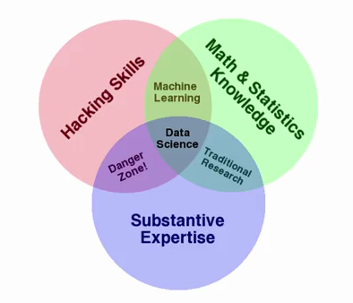

# Introduction

Roosevelt: Value *doing* over criticism

Key challenge: (Dan Myer)
Is there ever a worthwhile problem that has not too much, too noisy or too little data?

Philosophy: Question first, then data, then answer question using data.

New and *reproducible* insight!

## Motivation 

There are lots of data.

There are new *kinds* of data so we can answer questions we could not have answered in the olden times.

Statistics: science of learning from data that have *uncertainties*.

There is lots of money in the field right now. It's new! A frontier?

## Goal

New stuff, there are no textbooks! → have to find answers for ourselves on the web.

Be aware of other names depending on field: biostatistics, data science, machine learning, natural language processing, signal processing, business analytics, econometrics, statistical process control, ... (cf Finding Answers, slide 5)

## Target tasks

 * Define the question
 * Define the ideal data set
 * Determine what data you can access
 * Obtain the data
 * Clean the data
 * Exploratory data analysis
 * Statistical prediction/modeling
 * Interpret results
 * Challenge results
 * Synthesize/write up results
 * Create reproducible code
 * Distribute results to other people
 
So we will have to learn the tools for each of these tasks!

## Tools

 * R with RStudio -- workhorse, free
 
   * `script.R`
   * `document.Rmd` 
   
 * Git via Github
 * Shell
 * Community -- in particular forum on Coursera
 

