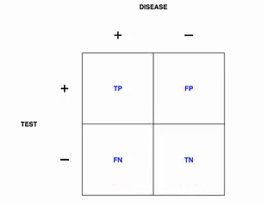

## Types of Data Science Questions

### Descriptive

 * Describe data
 * No interpretation, no derived decisions
 * *Examples:* census data, Google ngrams

### Exploratory

 * Find new relationships
 * Guide future research
 * Not used for generalization or predictions
 * **Correllation does not imply causation!**
 * *Examples:* brain scans; sky images

### Inferential

 * Use small sample to infer statement about larger/whole population
 * Commonly asked question
 * Estimate quantity of interest *and* uncertainty about that estimate.
 * Depends on population and sampling scheme (obviously!)
 * *Examples:* ? (everywhere?)

### Predictive

 * Use data on A to predict values for B
 * X predicts Y <=/=> X causes Y
 * Make sure to measure the right variables
 * More data and simple model work well
 * Hard
 * *Examples:* elections; weather; targetted shopping recommendations

### Causal

 * Determine how changing one variable influences the values of others.
 * Usually randomized studies on average effects.
 * Gold standard: this is what we want!
 * *Examples:* drug trials

### Mechanistic

 * Causal + quantification
 * Hard!
 * Workable where deterministic (e.g. simplified physical) models are available.
   Measurement errors introduce random effects/noise.

## Data

> Data are values of qualitative or quantitative variables (measurement or characteristic of an item), belonging to a set of items.  
> (Wikipedia)

Examples: sequencing data; result of an API call; medical records
US data source: [data.gov](http://data.gov).

Data can have raw form (more or less structured text, video, audio, ...),
needs to be *parsed* first! Then, it may be in "nice" spreadsheet form.

*Remember:* The *question* comes first and is thus more important!

## Big Data

 * We generate *lots* of data.
 * Some datasets are too much for a single desktop/laptop computer.
 * What is "big" changes over time.
 * *Example:* Original small-world study (1969) had $N=296$.
   Comparable research today on IM/social networks have $N \approx 10^8$.
 * We can collect and store much more data much more cheaply than we could a few decades ago.
   But are all this data *useful* for answering your question? You need the *right* data.

> The data may not contain the answer. The combination of some data and an
> aching desire for an answer does not ensure that reasonable answer can be
> extracted from a given body of data...  
> (John Tukey)  
> ... no matter how big the data are.  
> (Leek)

## Designing Experiments

 * Bad experiment design can lead to wrong claims can lead to bad real-life decisions.

    This is particularly dangerous in medicine.
 * Decide on analytical method (in an informed way) *before* collecting data!
    Only then do you know what you have to be careful about during designing your
    experiment.
 * Also have a plan for data and code sharing. (Github, figshare)

    Data too large? See [Leek's guide](https://github.com/jtleek/datasharing).

So this is the roadmap:

 1. Formulate your question.
 2. Design suitable experiment.
 3. Implement experiment (repeatedly).
 4. Collect and analyze descriptive data.
    Measure variability (across repetitions) and compare to the "signal".
 5. Attempt inference/generalization; be aware of your (statistical) confidence.
 6. If results warrant it, take action.

Be *transparent*, i.e. show data and code!

### Confounding

**Big danger!**
Correlation can be caused by dependence, but also by shared reasons.

Ways to avoid confounding:

 * Preferable: *Fix* (as many) *variables* (as possible).
 * If that's not an option, *stratify* (i.e. use all values equally often).
 * If neither is possible, *randomize*.

   If your sample is big enough, matches between controlled and confounding
   variable will be spread out, i.e. effect of confounding variables
   produces *noise*, not effect.

### Prediction

 * Is not the same as inference!
 * We want to train a predictor on a small sample.
 * Can we predict the outcome on a new individual?
 * Depends on the data; for instance, strongly overlapping normal distributions
    do not lend themselves well to prediction.

    Pay attention to relative size of effects!

These are the outcomes of interest:

*Sensitivity*:                  Pr(test +     | disease)  
*Specificity*:                  Pr(test -     | no disease)  
*Positive predictive value*:    Pr(disease    | test +)  
*Negative predictive value*:    Pr(no disease | test -)  
*Accuracy*:                     Pr(correct outcome)  

### Data Dredging

If the data do not support your hypothesis, do not change the hypothesis
until it fits!
(See above: question first! Does your experiment design still fit the question?)
