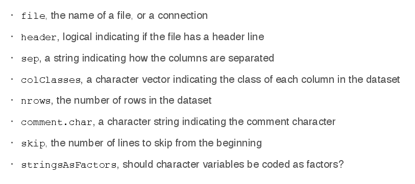

*Prerequisites:* Have R and RStudio installed. Okay, after course 1 we've got that.

*Recommendation:* Have an R shell open while watching the lectures.

---

This week covers

 * basic datatypes and functions, and
 * basic syntax.

## Overview and History of R

Find resources on [CRAN](http://cran.r-project.org).

Springer has a book series called *Use R!*.
Other books are listed on [r-project.org/doc/bib/R-books](http://r-project.org/doc/bib/R-books.html).

### History of R

 * R is a dialect of S
 * S (Bell labs)

    * 1976: Fortran libraries for statistics
    * 1988: C rewrite
    * 1998: version 4 (basically current version)

   Commercially owned (TIBCO; today S-PLUS).

   *Key idea:*
   interactive environment;
   should not feel like programming (in the beginning);
   focus on doing statistical analysis;
   ease user into programming

 * R: started 1991, announced 1993

   * 1995: GPL
   * 1997: R Core Group formed (controls primary source code)
   * 2000: v1.0.0
   * 2013: v3.0.2
   * ongoing development

### Features of R

 * Syntax: similar to S
 * Semantics: look similar, but different
 * Runs "everywhere".
 * Frequent releases, very active development.
 * Core R is lean; many modular packages
 * Lots of graphical functionality
 * Smooth transition from user to programmer
 * Active user community (mailing lists, SO)
 * Free -- no cost *and* [Stallman-free](http://fsf.org)!

### Drawbacks of R

 * Based on 40-year-old technology.
 * Little support for dynamic or 3D graphics. Packages may help.
 * Functionality is based on consumer demand and user contribution.
   No "feature request hotline".
    (Just like any software that is not owned by a company, duh.)
 * Object size limited by physical memory (solutions may be upcoming).
 * Not ideal for *everything* -- of course not!

### Design of the R system

Base system (`base` plus some other packages, plus some recommended packages),
then everything else.
Find all the stuff on CRAN (4000+ packages) and bioconductor.org.
More things exist off these platforms.


## R Basics: Data types

 * There are five atomic classes:
   `character` (strings), `numeric` (real numbers), `integer`, `complex` and `logical` (boolean).
 * Next most basic object: `vector` of things of the same class.
 * `list` is like a vector, but can contain objects of different classes.
 * `1` --> `numeric`; `1L` --> `integer`
 * Special numbers are `Inf`, `-Inf`, `NaN` (not a number; missing values).
 * Objects can *have attributes* such as names, dimensions, class, length, ...
   Access list via `attributes()`, attributes by `attr(o, "name")`.
 * `class(o)` returns the class of `o` (as string).
 * Objects can have *names*. Access with `names(o)`. Use to have self-describing data!

    For atomic values, use `names(o) <- "name"`.
 * There are lots of conversion functions names `as.X`.

### Vectors

 * Create with `c(a,b,c,...)`. If you use named parameters,
   the components will have these names.

    Useful parameter: `recursive = TRUE` flattens vectors or lists among the
    parameters.
 * Appending works by *nesting*: `c(c(1,2),3)` gives the same as `c(1,2,3)`.
 * Only one type; if you mix types objects are *coerced* to a "least common denominator" type.
 * `as.<type>(x)` converts `x` to `<type>` (a basic type).
    If a value can not be coerced, you get `NA`s.
 * Scalar functions apply to vectors in element-wise fashion.
 * Arithmetic operators/relations are overloaded to work in element-wise fashion as well.
    These vectorize, i.e. can be evaluated in parallel.
 * Assign names after creation by `names(x) <- c("name1", ...)`.
 * Check vectors for equality with `identical()`.
 * `length()` gives you the number of elements.

### Lists

 * Create with `list(a,b,c,...)`.
 * Similar to vectors but can contain elements of different classes.
 * Note how `l[1]` (type `list`) is not the same as `l[[1]]` (type of the element)!

    However, `l[1]+` seem all to be the same, but other `l[1][0]` is `list()` and
    `l[1][i]` is `NULL` for `i>1`. Huh.

    *Note to self:* look up what lists *actually* are, and how they are represented.
    They are quite clearly not "just like vectors".
 * Assign names by using named parameters in `list` call, e.g. `list(a = 1, b = 2)`.

### Matrices

 * Vectors with `dimension` attribute `dim(m)`, a vector of integers: number of rows, number of columns.
 * Create with `matrix(nrow = m, ncol = n)`.
 * *Recall:* can get list of attributes with `attributes(o)`.
 * **Important:** Matrices are created *column-wise*. (Try out `m <- matrix(1:6, nrow=2, ncol=3)`.
 * By (re)setting `dim(m) <- c(a,b)` you can change the shape of a matrix!

   *Note to self:* How is that implemented? Are matrixes just flat arrays --
   then how on earth are operations on matrices supposed to be efficient?
   Or do they re-allocate the whole thing when you do this?
 * Can also use `cbind(a,b)` or `rbind(a,b)` with vectors `a`, `b` to create a matrix with
   (named) columns resp. rows initialized with the values from `a` and `b` from top to bottom
   resp. left to right.
 * Operations vectorize here as well.
 * **Note:** `m1 * m2` is element-wise multiplication; matrix multiplication is `%*%`.
 * Assign names by `dimnames(m) <- list(c("row1", "row2", ...), c("col1", "col2", ...))`.
   You can then access values by using names as well, e.g. `m["row1", "col2"]`.

    *Note:* changing `dim(m)` will reset the names.
 * Transpose matrices with `t()`.

### Factors

 * Special type of vector for categorical data. Exists ordered and unordered.
   Each entry (integers) have a *label*.

   Use labels for your values ("male", "female") -- called *levels* -- which are internally
   represented by integers (1,2).
 * Modelling functions treat factors in special ways, e.g. `lm()` and `glm()` (see later).
 * Use these over plain integers: more descriptive, can't be mistaken for continuous data.
 * Create with `factor(v)` with `v` a character vector.
 * Print nicely with `table(f)`.
 * `unclass(x)` exposes internal representation.
 * Reorder levels/labels by adding parameter `levels = c("label 1", "label 2", ...)` to `factor()`.
   (Default: alphabetical. First is baseline level.)
 * Generate numerical factors concisely with `gl()`
 * Combine factors with `interaction()`.

### Missing values

 * `NaN` (undefined mathematical operations; "not a number") and `NA` (everything else; "missing values").
 * Test with `is.na()` and `is.nan()`.
 * `NA` values have a class (the one their should-be values would have had).
 * `NaN` is a `NA`.

### Data frames

 * Represents tabular data
 * Special type of list: list of columns (each of the same list). Columns can have different types.
 * Data frames relate to matrices like lists to vectors.
 * Create with `data.frame(column1 = vector1, column2 = vector2, ...)`.

   Usually created by `read.table()` and `read.csv()`, though.
 * Convert to a matrix by `data.matrix()` (values will be coerced).
 * Special attribute `row.names`. Get number of rows and columns with `nrow()` and `ncol()`, resp.
 * Transpose data frames with `t()`.
 * Keep in mind functions `na.omit` et al. -- they detect and clean out `NA`s
   from data frames. No need to wrangle with complicated logical indices.
   For instance:

   ```R
    > x <- data.frame(c(1,NA,NA,2),c(NA,3,NA,4))
    > colnames(x) <- c("A","B")
    > na.omit(x)
    A B
    4 2 4
    ```


## Reading data into R

 * `read.table` and `read.csv`: read tabular data, create data frames (inverse: `write.table`).
 * `readLines` reads strings from an unstructured text file (inverse of `writeLines`).
 * `source` reads R code files (inverse of `dump`).
 * `dget` reads R code files with deparsed objects (inverse of `dput`).
 * `load` reads saved workspaces (inverse of `save`).
 * `unserialize` reads single R objects in binary form (inverse of `serialize`).

### `read.table`

Very common. Parameters:



 * Ad `stringsAsFactors`: defaults to `TRUE`, reads in character variables as factors.
 * Often just `read.table("file")` works; R figures out stuff by itself.
 * Lines beginning with `#` are automatically skipped.
 * Specify more parameters to speed up reading data.

`read.csv` is just `read.table` with comma as default separator (`read.table` uses space).

When reading *large* files:

 * Read `help(read.table)`. Lots of stuff for optimising calls there.
 * Calculate a rough estimate for the amount of memory you will need.
   Recall that R will store everything in memory!)

   Size of values: 8 bytes per `numeric` (on 64bit).
 * If there are comment lines, set `comment.char = ""`.
 * Use `colClasses` -- otherwise R will go through the whole columns to figure out types.

    Shorthand if all are the same: `colClasses = "type"`.

    You can also make R infer types from a few lines by `a <- read.table("f", nrows = 100)`
    and use `sapply(initial, class)` with the `colClasses` parameter for the call that
    reads everything.
 * Set `nrows` helps with memory usage. Mild overestimates (e.g. `wc -l f`) are okay.
 * Know your system: RAM, other apps, other users, OS, 32 vs 64 bits

### Textual data: `dump` and `dput`

 * Good for storing data.
 * Preserve *metadata*, e.g. types of values in objects.
 * Can edit if absolutely necessary.
 * Work well with VCS.
 * Always accessible.
 * Not very space efficient (but can compress).
 * `dput` creates R code that recreates the exact object. `dget(dput(o))` gives `o`.
 * `dump` is similar to `dput` but takes names of multiple objects (in a vector).
   `source` reads files create by `dump`.


### Interfaces

There are *connections* to stuff outside of R. Common interface for different types of connections.

 * `file` opens a connection to a file.

    Parameter `open` can be `"r"` (read-only), `"w"` (writing), `"a"` (appending).
    (Windows has `"rb"`, `"wb"` and `"ab"` for binary mode.)
 * `gzfile` and `bzfile` open connections to compressed files.
 * `url` opens a connection to a webpage.

Ways to use the connection interface:

 * `readLines(con, a)` will read `a` many lines only.
 * `writeLines` takes a character vector; each element becomes a line in the target file.

Close connections with `close(con)`.


## Subsetting

 * `[...]` returns an object of the same class as the original; can extract more than one element
    (one exception).

  * Can subset w.r.t. vectors of indices. Positive indices mean "take that
    element", negative one "don't take that element". No mixing of the two.
  * Can use *logical* indices (predicates), e.g. `x[x > 5]` which is short for `u <- x > 5; x[u]`.
  * Applied on lists, it gives you a list with the specified value(s).
    Use `l[c("name1", "name2")]` to select a sublist by name.
  * Applied to data frames, `df[p, cols]` gives you a new data frame consisting
    of the columns with the names in (character) vector `cols` that are marked
    by logical index `p`.
 * `[[...]]` extracts single elements only (from lists or data frames), ergo different type.

  * Takes indices or names (as characters).
  * **Note:** When given a sequence of integers, accesses *nested* elements -- unlike `[...]`!
 * `$` extracts elements of lists of data frames *by name*; otherwise similar semantics as `[[...]]`.

  * `x$bar` is the same as `x[["bar"]]`, both different from `x["bar"]`.
  * Can not use computed names!
  * *Note to self:* why should we ever use `$`? Just because it is shorter?

 * `which()` extracts the integer indices at which a logical index is `TRUE`.
   For example, `which(1:10 %% 2 == 0)` returns `c(2,4,6,8,10)` -- which
   can be used for subsetting just like the logical index (and other things).

### Matrices

 * Use `m[i,j]` to access element `i` in row `j`.
 * Missing indices mean "gives me all"; `m[i,]` gives ith row, `m[,j]` gives jth column.
 * **Note:** By default, we *don't* get a 1x1 matrix when accessing a `m[i,i]`
    but a vector with a single element; the dimension is dropped.
    Similarly, whole rows or columns are given back as vectors.
    Add `drop = FALSE` to suppress this.

### Partial matching

Speeds up interaction with the CLI. `l$f` will access the name which has `f` as prefix (and `NULL` if there is no single one such). Does not work with `[[...]]` in the same way, needs added `exact = FALSE`.

*Note to self:* seems to be obsolete; probably bad style in scripts/programs and the interactive shell has tab-completion.

### Removing missing values

`x[!is.na(x)]` will give you the vector that contains all elements of `x` that are not `NA`.

`complete.cases()` gives logical vector with `TRUE` in all positions at which *all* specified
vectors are not `NA`. Also works with data frames: `frame[complete.cases(frame),]`.
