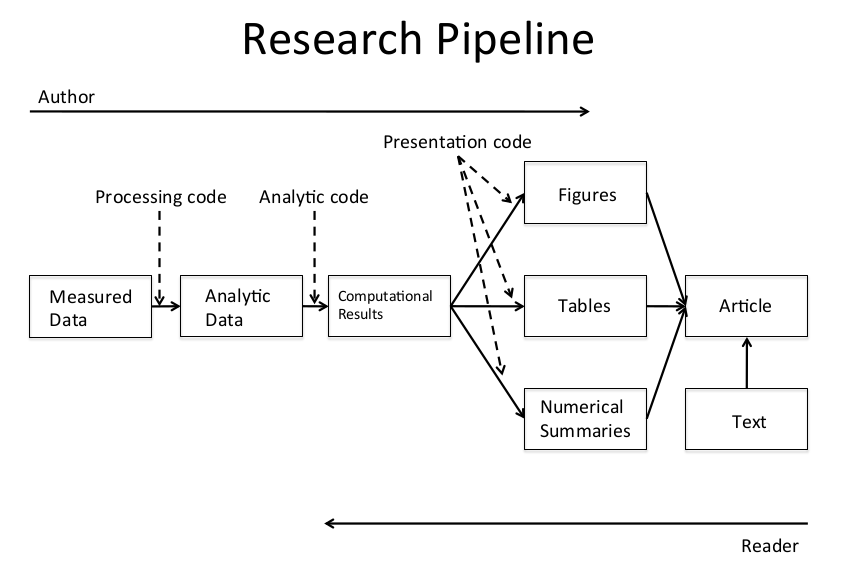

## Concepts and Ideas

Products of data analysis are items of *communication*: we want to tell
others what we did and how we did it in a way that these others can use
to retrace out steps, to *reproduce* our results.

This goes back to the scientific method; a finding is strengthened by
*independent replication* of the same result. However, some studies can not
be replicated (lack of time or money, or unique circumstances).

Instead of doing *nothing* in such cases we want to at least provide
*reproducability*: original data and code used for the analysis are made
available so people can investigate either themselves and thus validate your
method(s) of analysis.

Also, going forward, new technology or method can offer new ways of analysis,
and data from different sources can be merged to perform larger analyses.

Some studies concern *small signals* but have *huge potential impact* and are
thus subject to intense scrutiny. That means that the analyses have to be as
transparent as possible -- which means reproducible.

Consider the *research pipeline* (image from the course slides):

Instead of giving the reader only the finished article, we want to enable them
to look at all the steps that led to it.

**What do we need?**

 1. Analytic data are available
 2. Analytic code are available
 3. Documentation of code and data
 4. Standard means of distribution
 
*Note:* We usually do not need raw data.

Both authors and readers need good tools!

Making reproducible research available can be quite an effort (so often things
are just uploaded in any way without much organisation)S,
and reproducing itself can be tricky (multiple downloads, what goes where, ...)
or impractical (e.g. due to lack of computing power).

One promising it *literate* programming, i.e. mixing text and code.
By *weaving* we get human-readable documents, *tangling* gets us machine-readable
versions. Examples in statistics include Sweave (LaTeX + R) and 
`knitr` (LaTeX/Markdown/HTML + R/...).

> **Golden Rule of Reproducibility**

> **Script Everything**

## Structure of Data Analysis

Recall the typical [steps of data analysis](../01 Data Scientist's Toolbox/week1.md#target-tasks).
All steps matter in this context!

 * Defining the question can be the most powerful filter: 
   you can get rid of everything that does not relate to the question.

    Beware the "danger zone" of throwing methods of applied science onf
    data without being led by a concrete scientific question in your choices
    of data and methods.

 * Standard scientific practice applies to obtaining data:
    document where and how you got it, give proper attribution,
    observe licensing terms.
    
 * Document any preprocessing, cleaning or reformatting the data --
    no matter if you do it or it's already been done!
    
    **Important:** If the data are not good enough, abort!
    
Generally speaking, document all decisions (human language) and 
processing steps (code) you make.

## Organizing Your Analysis

Generally, we get these kinds of files:

 * Data (raw, processed/tidy)
 * Figures (exploratory, final)
 * Code (raw/unused, final, literate)
 * Text (readme, documentation, reports)
