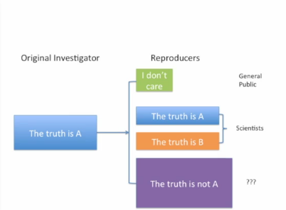

## Communicating Results

Break down results at *different levels of granularity/detail*.

In a paper, refine from title over abstract to the main text, 
go full detail in the supplementary materials.
Code and data is yet another level.

Tailor the level of detail to the addressee!

## Reproducible Research Checklist

Here are some items that are useful towards making sure that your analysis
is reproducible.

*Remember:* Not the same as replication!

### Do!

 1. **Start with good science!**
 
     Research is garbage in, garbage out: start with a coherent, focused and
     interesting question, work with good collaborators, ...
     
 2. **Teach a computer!**
 
     Automate/script everything! If you do that, everything is by necessity
     precise and reproducible.
     
 3. **Use version control!**
 
     Commit small chunks -- slow down! You can always go back.
     Platforms like Github allow easy publishing.
     
 4. **Keep track of computing environment!**
 
     Hardware specifications and software versions can be critical to
     reproducability!
     
     In R, function `sessionInfo()` can be useful.
     
 5. **Set your seed!**
 
     Setting seeds of PRNGs allows reproducible random simulations.
     In R, use `set.seed()`.
     
 6. **Think about the entire pipeline!**
 
     Every step from raw data to final report is imporant and needs to be
     reproducible.

### Don't!

 1. **Don't do things by hand!**
 
     Manual editing of data (or results), downloading or reformatting data, ... 
     are hard to document precisely (so that people with other backgrounds
     can retrace your steps) and thus hard to reproduce *exactly*.
     
     "We're just going to do this once..." -- *nope*.
     
 2. **Don't point and click!**
 
      GUI actions can usually not be properly documented and reproduced.
      Be especially careful with interactive tools, in particular during
      exploratory analysis.
      
 3. **Don't save output!**
 
     Stray outputs are not reproducible, so don't pretent by storing them.
     Intermediate files can be okay if their respective creation processes are
     clearly documented.
     
     
     
## Evidence-Based Data Analysis

Many people (have to) do complicated analysis without having the proper training.
As a result, complicated analyses are rarely trusted.

Recall the [research pipeline](week1.md): if there is only the published article,
you have no choice but to go back to nature (or whichever source of the original
data) -- that is to replicate. Reproducible research is about filling that gap
and allow everybody to verify all the steps that lead to the reported results.

We get

 * transparency,
 * availability of data,
 * availability of methods and software, and
 * improved transfer of knowledge.
 
We do, however, *not* immediately get *validity/correctness* of the results --
careful checking is needed. Therefore, reproducibility alone does not imply
we can trust any given analysis.

We *can*, in principle, establish trust by people checking each other's work,
but only

  * only post-publication and
  * only if everybody plays by the same rules and towards the same goals 
     -- which is not true in reality.

We could improve the system by integrating reproduction into the peer review 
process everywhere. Is that realistic? Probably not. 
But it *does* happen in some places, e.g. at the Journal of Biostatistics on a 
voluntary basis.

So: what can we do about the most upstream part, the actual (and potentially 
problematic) research?

If reproducibility is to be effective for purposes of validadation,
someone needs to
 
 1. re-run the analysis and check if the results match,
 2. check the code for bugs and errors, and
 3. try alternative approaches and check sensitivity.
 
But *who is this someone* and what are their goals?
Do people qualified to validate your work any incentive to reproduce?

What to do?

### The vision

Use *thoroughly studied and mutually agreed-upon* methods in your
analysis whenever possible.
    
There should be *evidence* justifying the applicability of whichever
method you choose.
    
*Example:* Choosing bin-width for histograms according to Sturges (1926)
and Scott (1979) (default in R).

We should strive to create analytiv pipelines from evidence-based components
and standardize them; see e.g. Leek's 
  [deterministic statistical machine](http://simplystatistics.org/2012/08/27/a-deterministic-statistical-machine/).
  

  
We then should *not* mess with these pipelines and trust in its validity;
we have removed or at least reduced "researcher degrees of freedom" as a 
source of errors.
You can compare this to the concept of pre-specified clinical trial protocols.

First efforts are underway.
