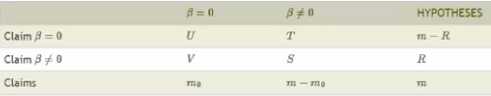

## Power

*Power* is the probability of rejecting the null hypothesis when it is false
(1 - beta).
Inspecting the power of a test can help us design studies -- once we have data
*and* controlled for significance, there is little more we can do to increase
power.

If we want to compute the power explicitly, we have to make specific assumption
about the alternative hypothesis, or give it as a function of free parameters
(and the sample size). 

The basic formula is

1 - beta = Pr[ mean(X) > µ_0 + z_(1-alpha) * sigma/sqrt(n) | µ = µ_a ]

assuming that mean(X) ~ N(µ_a, sigma²/n) and we use the z-statistic.
The unknowns are here µ_a, sigma, n, and beta.
We can assume or fix three and can then derive the fourth.
That allows us to estimate the power for a fixed trial design,
or change the trial design so that we can achieve decent power.

Note that we may be willing to assume that the alternative is normal due
to the CLT. Unless we can make *some* assumption on the alternative distribution,
we can not calculate power.

Calculating power for t-tests is more complicated as the test statistic
does not follow a t-distribution under µ_a (but instead a non-central t-distribution). 
`power.t.test()` in R can do the calculations for us.
Leave out one parameter and it solves for it.

*Note:* 

 * Power increases with increasing alpha (i.e. decreasing significance). 
 * Power increases with decrease of noise (sigma). 
 * Power increases the farther null and alternative hypothesis are apart
    (cf. minimum detectable distance).
 * Power increases with growing sample size n.
 * Power of a one-sided test is greater than that of the associated two-sided test.
 
Power only depends on sqrt(n)(µ_a - µ_0)/sigma; we do not need to know the
individual terms. (µ_a - µ_0)/sigma is called the *effect size*; being a unit-free
quantity, there is some hope that it can be interpreted in meaningful ways across
different settings.

## Multiple Testing

We want to correct for multiple testing, i.e. changing the test until reaching
an acceptable p-value, in order to avoid false positives/discoveries.

*Example* from XKCD 882: Testing whether jelly beans cause acne does not
show a connection. Testing each color individually, we finally find one color
with a significant connection.  
Our confidence is 95%. Say we performed 20 (or more) tests with that alpha = 5%;
the likelihood that one test gave the wrong result is not insignificant.

Performing many (i.e. tens of thousands or more) tests is common in genomics,
imaging, astronomy, and other signal-processing disciplines.

### Error measures

Let V the number of false positives among m tests 
(i.e. rejections even though µ_0 is true), 
m_0 the number of tests where µ_0 is actually true, 
and R the number of tests where we reject µ_0.

 * *False positive rate (FPR):* E[ V/m_0 ].
 * *Family-wise error rate (FWER):* Pr[ V >= 1 ]
 * *False discovery rate (FDR):* E[ V/R ]

Below there are basic methods. There are many more!
For instance, if there is strong dependence between tests, consider
`method="BY"`.

### Controlling FPR

Calling all P < alpha significant will control the FPR at level alpha on
average.

*Problem:* The expected number of false positives m * FPR can still be large!

### Controlling FWER

Say we want to control FWER at level alpha, i.e. Pr[ V >= 1 ] < alpha.
That's quite strong!

*Bonferroni correction:*
Set alpha_fwer = alpha/m and 
call all P-values less than alpha_fwer significant.

This is easy to calculate and conservative, 
but maybe *too* conservative.

### Controlling FDR

Say we want to control FDR at level alpha, so E[ V/R ] < alpha.

Call any P_(i) <= alpha * i/m significant, with P_(i) the ith-smallest P-value.

This is still easy to calculate and a (maybe a lot) less conservative,
but allows for (many) more false positives and may behave strangely under dependence.

This is called Benjamini-Hochberg (BH) correction.

### Adjusted P-values

We can compute

P_i^fwer = max (m * P_i, 1)

and call all P_i^fwer < alpha significant; this controls for FWER < alpha.

This gives the same results as using Bonferroni correction.
Similar adjustments exist for BH, so we can just do this instead of adjusting
alpha.

*In R:* Use `p.adjust()`.

## Resampling / Bootstrap

The bootstrap is useful for constructing confidence intervals and calculating
standard errors for difficult statistics -- without doing a lot of
complicated mathematics!

*Idea:* Sample repeatedly from the distribution as estimated by the given data.
Use the sample statistic of all the repetitions as estimator for the 
(unknown) distribution of the statistic, e.g. by calculating confidence intervals
or standard deviation/error.

We *could* figure out the bootstrap distribution of the statistic explicitly;
instead, we will usually just simulate it (Monte Carlo approach).
By iterating many times, the error becomes small.

### Bootstrap for the median

Assume we have a data set with n observations. Let B some (large) number.

 1. For i = 1 .. B:
 
    1. Sample n observations *with replacement* (uniformly) from the observed data.
    2. Set M_i to be the median of the resulting data set.
    
 2. Derive the desired information, such as one of the following.
 
     * Draw a histogram of the M_i as an estimate of the density.
     * Calculate the standard deviation of the M_i in order to estimate the
        standard error of the median.
     * Take the alpha/2 and 1-alpha/2 quantiles as a 1-alpha (bootstrap)
        confidence interval for the median.
    
Step 2 is possible because the M_i have been *approximately* drawn from the sampling
distribution of the median of n observation.

*Note:* 

 * The method given above is the *non-parametric* bootstrap. Variants exist.
 
    See *An Introduction to the Bootstrap* by Efron and Tibshirani for more.
 * The confidence interval as proposed above is not very good.
    Use the bias-corrected accelerated (BCA) variant instead.
    
    
    
## Permutation testing

Say we want to compare samples from two distinct, independent distributions.
The null hypothesis would be that the distributions are the same.

*Idea:* 
Permute the labels and compute the test statistic. 
Iterate and calculuate the percentage of runs in which the simulated statistic
was more extreme (towards the alternative) than the observed one.
This gives us a simulated P-value.

*Other names:* 
rank sum test (for rank data); 
Fisher's exact test (for binary data);
randomization test (same approach, but different motivation and conclusion).
